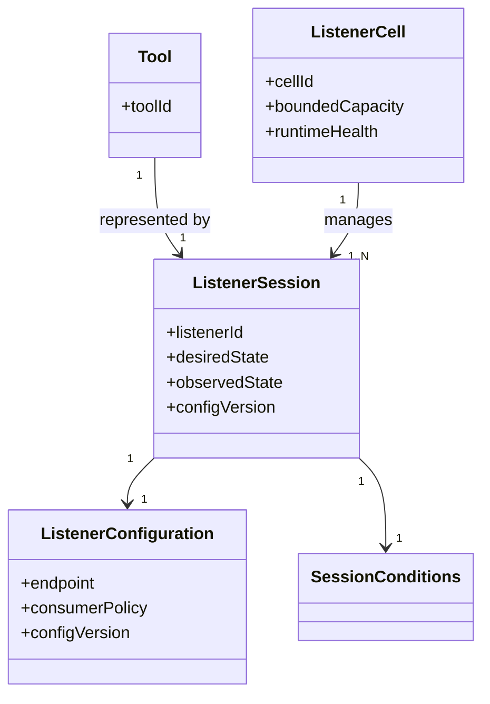
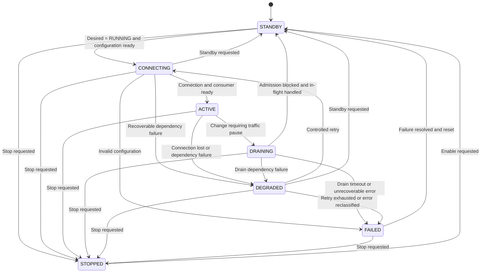

# Listener Lifecycle and Message Admission  
## Architecture Guidance

**Status:** Draft v1.1（v1.1：`observedPhase` 更名為 `observedState`，lifecycle 相關之 phase 用語統一為 state）  
**Audience:** Product Engineering Team  
**Scope:** Current Kafka Listener、Future NATS JetStream Migration、K8S Runtime

> 本文件中的 **Tool** 代表對應的設備／Device 單位。

---

# 0. Summary

**核心問題不是單純的操作流程問題，也不是 Kafka 或 NATS 本身的限制，而是目前 Listener architecture design 存在兩層耦合。**

## 兩層耦合

### 1. Topology / Instance Coupling

```text
Tool
↔ Upstream System E
↔ Kafka / NATS Messaging Endpoint
↔ Listener Instance
↔ K8S Deployment
↔ Data Pipeline
```

目前每個 Tool／Messaging endpoint 直接對應一個 Listener instance 與 K8S Deployment，缺少可獨立管理的 `ListenerSession` abstraction。

因此，任何 Tool onboarding、上游設定或 Messaging endpoint 異動，都會被放大成 Deployment-level change。

### 2. Runtime Lifecycle Coupling

目前以下 application-level concerns 與 K8S workload lifecycle 綁定：

```text
Listener Configuration / Version
+
Runtime Lifecycle
+
Messaging Connection / Consumer
+
Message Consumption
+
Message Admission into Data Pipeline
```

因此，上游系統變更時，必須透過 Deployment update、restart、remove 或 reprovision，才能：

- 停止訊息消費
- 阻止資料提前進入 Data Pipeline
- 關閉或重建 Messaging connection
- 套用新的 Listener configuration
- 恢復 Listener 運作

目前 error handling 也將多種不同問題轉換為 process crash，再由 K8S restart。

## 建議方向

**短期**：在現有 One Tool → One Listener Deployment 架構上建立自動控制，導入 application-level lifecycle 與 automated reconciliation，消除人工 stop、wait 與 reprovision。

**長期**：移除 Tool 與 Deployment 的一對一架構，改為：

```text
Tool
→ ListenerSession
→ Bounded Listener Cell
```

以 per-session isolation 限制 cross-tool blast radius。

詳見 Section 5。

---

# 1. Context

目前 end-to-end message flow：

```text
Tool
→ Upstream System E
→ Per-tool Kafka
→ Our Listener
→ Our Data Pipeline
→ Downstream Notification
```

目前主要特性：

- 每個 Tool 對應一個獨立 Kafka endpoint。
- 每個 Tool 對應一個 Listener K8S Deployment。
- Listener configuration 主要透過 Deployment YAML、Helm values、ConfigMap、Secret 或 startup configuration 提供。
- 系統未來將由 Kafka 遷移至 NATS JetStream。

當 Upstream System E 進行設定變更時：

- 訊息仍可能持續進入 Kafka。
- 為避免 connection error 與資料提前進入 Data Pipeline，目前會先停止或移除 Listener。
- 上游完成後，再修改 Listener configuration 並重新 provision Listener。

目前實際使用 K8S Deployment lifecycle，同時控制：

```text
Listener Runtime
+
Messaging Connection
+
Message Consumption
+
Message Admission
```

**結果是 Tool-level change 被放大成 Deployment-level change。**

---

# 2. Problem Analysis: Two Layers of Coupling

## 2.1 Topology / Instance Coupling

> **這一層描述：為什麼一個 Tool 或 Messaging endpoint 的變更，會直接變成 K8S Deployment change。**

目前 topology 接近：

```text
One Tool
→ One Kafka Endpoint
→ One Listener Instance
→ One K8S Deployment
```

Tool identity、Messaging endpoint、Listener process 與 K8S Deployment 形成直接的一對一映射。

目前缺少可獨立管理的 `ListenerSession` abstraction，因此：

- Tool onboarding 需要建立 Deployment。
- Messaging endpoint 異動需要修改 Deployment。
- 上游系統設定變更需要操作 Deployment。
- Tool lifecycle 直接被映射成 Deployment lifecycle。

這是**結構上的耦合**。

即使 Listener 內部具備較完整的 connection 或 retry 能力，只要 Tool 仍直接對應一個 Deployment，Tool-level change 仍然容易成為 Deployment-level change。

---

## 2.2 Runtime Lifecycle Coupling

> **這一層描述：為什麼 Listener 的暫停、重連、設定更新與資料流控制，都必須透過 K8S workload operation 完成。**

Listener Runtime 中包含以下不同控制責任：

```text
Listener Configuration / Version
+
Runtime Lifecycle
+
Messaging Connection / Consumer
+
Message Consumption
+
Message Admission
```

| 控制責任 | 回答的問題 |
|---|---|
| Listener Configuration | Listener 應使用哪一版 endpoint、credential 與 consumer 設定？ |
| Runtime Lifecycle | ListenerSession 應處於 Running、Standby 或 Stopped？ |
| Messaging Connection | 是否已連上 Kafka／NATS，Consumer 是否可用？ |
| Message Consumption | 是否正在從 Messaging System 取得訊息？ |
| Message Admission | 訊息是否允許進入 Data Pipeline？ |

這些責任具有不同語意。

例如，架構上應允許：

```text
Runtime = Running
Connection = Connected
Consumption = Paused
Admission = Blocked
```

但目前這些行為主要由 K8S Deployment lifecycle 一起控制，導致：

- 無法只停止 message admission 而保留 Runtime。
- 無法只重建 connection 而保留 Runtime。
- 無法在 Runtime 存活時暫停資料流。
- External dependency failure 容易被視為 process failure。
- Configuration update 容易被轉換成 Pod restart。

因此，目前無法在 Listener Runtime 內獨立執行：

- 暫停訊息消費
- 阻止訊息進入 Data Pipeline
- Drain in-flight messages
- 關閉或重建 Messaging connection
- 載入新的 Listener configuration
- Connection failure 後執行 controlled retry
- 表達 Runtime 正常，但 Upstream 尚未 ready

上述操作通常需要：

- Deployment update
- Pod restart
- Deployment removal
- Reprovision

這是**行為與生命週期上的耦合**。

---

# 3. Current Engineering and Operational Impact

本章只描述目前 Kafka 架構下已經發生的問題。

## 3.1 Configuration Change 被放大成 Deployment Change

Endpoint、credential 或其他 Listener configuration 異動，本來應屬於 application configuration change。

目前卻需要：

```text
Update YAML / Helm
→ Apply Deployment
→ Restart / Recreate Pod
→ Reinitialize Listener
→ Validate Message Flow
```

造成：

- Configuration change 與 software deployment change 無法清楚區分。
- 小型設定異動需要完整 K8S change。
- Listener 啟動後才能確認設定是否正確。
- 設定或 connection 錯誤發生時，需要再次 change 或 reprovision。

---

## 3.2 上下游 Change Timing 緊密耦合

目前流程依賴人工同步：

```text
Downstream stops Listener
→ Upstream performs change
→ Upstream confirms completion
→ Downstream reprovisions Listener
→ Both sides validate
```

造成：

- 人工等待
- Change window 延長
- 跨團隊同步成本
- 操作順序依賴
- 上游完成後仍需人工恢復
- 失敗時狀態與責任不清楚

---

## 3.3 Error Handling 以 Process Crash 作為主要機制

目前 Listener 對不同類型的錯誤，缺少 application-level failure classification 與 recovery behavior。

下列問題本質上可能只是 configuration error、external dependency failure 或暫時性 connection failure：

- Endpoint unavailable
- DNS failure
- Credential or TLS error
- Topic configuration error
- Authorization failure
- Upstream 尚未 ready
- Messaging connection temporarily unavailable

但目前主要處理方式是：

```text
Error occurs
→ Listener process exits or crashes
→ Pod enters Failed / CrashLoop state
→ K8S restarts the Pod
→ Listener reinitializes and retries
```

也就是將：

```text
Process Crash
```

同時用來表示：

- Configuration invalid
- External dependency unavailable
- Connection temporarily lost
- Runtime internal failure
- Unrecoverable application failure

這使不同 failure semantics 被混在一起。

### 造成的問題

- 暫時性 connection failure 被放大成完整 process restart。
- Configuration error 可能形成無限 CrashLoop。
- Runtime state、in-flight processing 與 diagnostic context 在 restart 時遺失。
- K8S liveness 被當成 application error handling mechanism。
- 無法清楚呈現 failure category、retry state 與人工處理需求。
- Restart storm 可能增加 Messaging endpoint、K8S 與 downstream 的負載。
- 操作人員只能看到 Pod failed，無法直接判斷真正原因。

正確方向應區分：

| Failure Type | Expected Behavior |
|---|---|
| Temporary dependency failure | Runtime 保持存活，進入 `DEGRADED` 並 controlled retry |
| Configuration incomplete | 停留在 `STANDBY`，以 `configurationReady: false` 呈現 |
| Invalid configuration | 進入 `FAILED`，停止無效 retry |
| Connection lost | 重建 connection，不重啟整個 Runtime |
| Internal unrecoverable failure | Process exit，由 K8S restart |

**Process crash 應只保留給 Runtime 本身無法安全繼續運作的情況，而不應作為一般 configuration、connection 或 dependency error 的主要處理方式。**

---

# 4. Architecture Principles

本文件保留三項核心原則。

## P1. 分清楚 K8S、Configuration 與 Listener Runtime 的責任

### K8S 管部署與 Process 存活

K8S 負責：

- Deployment 與 Pod lifecycle
- Replica 與 HA
- CPU／Memory resource
- Software version 與 rolling update
- Runtime process crash 後的 restart

### Listener Configuration 定義期望設定

Listener Configuration 定義：

- Messaging endpoint
- Credential／TLS setting
- Topic／Subject／Consumer policy
- Configuration version
- Desired state，例如 `RUNNING`、`STANDBY` 或 `STOPPED`

### Listener Runtime 管實際運作

Listener Runtime 根據 Configuration 管理：

- Runtime lifecycle
- Connection／Reconnect
- Consumer／Subscription
- Message consumption
- Message admission
- Drain
- Retry 與 failure handling
- Observed state 與 conditions

```text
Listener Configuration
        ↓ defines desired behavior

Listener Runtime
        ↓ executes and reports observed state

Kafka / NATS and Data Pipeline
```

K8S 只負責部署與 Runtime process 的存活，不應直接使用 Pod lifecycle 控制 Listener 的 connection、message consumption 或 message admission。

> **K8S 管部署，Configuration 定義期望，Listener Runtime 管運作。**

---

## P2. 一般錯誤不應以 Process Crash 處理

Configuration、connection 或 external dependency failure，應由 Listener Runtime 內的狀態與 recovery mechanism 處理。

| Failure | Expected Behavior |
|---|---|
| Messaging endpoint 暫時不可用 | 進入 `DEGRADED` 並 controlled retry |
| Configuration 尚未完成 | 停留在 `STANDBY`，以 condition 呈現未 ready |
| Configuration 無效 | 進入明確 failure state，停止無效 retry |
| Connection lost | 重建 connection |
| Runtime 無法安全繼續 | Process exit，由 K8S restart |

**Process crash 只應保留給 Runtime 本身無法安全繼續運作的情況。**

---

## P3. 每個 Tool 的狀態與故障必須可獨立管理

短期可以繼續維持 One Tool／One Deployment。

長期整併至 Shared Runtime 時，每個 Tool 必須對應獨立的 `ListenerSession`，並具備：

- Independent connection
- Independent retry
- Independent health
- Queue and in-flight limit
- Resource protection

**單一 Tool failure 不應影響其他 Tool。**

---

# 5. Phased Architecture Direction

短期與長期不是兩個競爭方案，而是處理不同層次問題的階段。

## 5.1 Short-term：在現有一對一架構上建立自動控制

短期先保留：

```text
One Tool
→ One Listener Deployment
```

主要目標是消除人工操作，由系統自動完成：

```text
STANDBY
→ Upstream Change
→ Apply Configuration
→ Reconnect
→ ACTIVE
```

完整流程詳見 Section 6.3。

第一階段即使仍需要 Deployment update 或 Pod restart，也應由 workflow 或 controller 自動執行。

**短期解決的是 operation automation 與 Runtime lifecycle control。**

---

## 5.2 Long-term：解除 Tool 與 Deployment 的一對一耦合

長期將對應關係改為：

```text
Tool
→ ListenerSession
→ Bounded Listener Cell
```

一個 K8S Runtime／Cell 可以管理多個 `ListenerSession`。

每個 Session 獨立管理：

- Configuration
- Connection
- Message consumption
- Lifecycle
- Retry
- Queue
- Health

修改單一 Tool 時，只影響對應的 ListenerSession，不需要重新部署整個 Runtime，也不應影響其他 Tool。

**長期解決的是 topology／instance coupling。**

---

## 5.3 Principle-to-Phase Mapping

| Architecture Principle | Short-term | Long-term |
|---|---|---|
| **P1 Responsibility separation** | 自動化 Deployment operation，逐步將控制移入 Listener Runtime | Configuration、Runtime 與 K8S responsibility 完整分離 |
| **P2 Error handling** | Connection 與 dependency failure 不再依賴 CrashLoop | Per-session failure classification 與 retry supervision |
| **P3 Tool isolation** | 保留 One Tool／One Pod 的隔離 | Bounded Cell 與 per-session isolation |

---

# 6. Short-term Objectives and Architecture

## 6.1 Short-term Objectives

| ID | Objective | Related Principle |
|---|---|---|
| **S1** | 消除人工 delete、wait、reprovision | P1 |
| **S2** | 導入 `STANDBY / CONNECTING / ACTIVE / DRAINING / DEGRADED / FAILED / STOPPED` lifecycle | P1 |
| **S3** | 建立 automated reconciliation | P1 |
| **S4** | Connection failure 不造成 CrashLoop | P2 |
| **S5** | 明確呈現 Listener、connection 與 failure 狀態 | P1、P2 |
| **S6** | 保留 One Tool／One Deployment，降低第一階段改造風險 | P3 |

---

## 6.2 Short-term Architecture

```text
Tool
→ Kafka / NATS JetStream
→ Persistent Listener Deployment
   └── One ListenerSession
→ Data Pipeline
```

短期仍維持一個 Tool 一個 Deployment，但 Listener 不再只是 startup-only process。

Listener 至少需要具備：

- Application-level `STANDBY`
- Message admission control
- Drain
- Explicit failure state
- Automated reconciliation
- Configuration version
- Controlled reconnect
- Pod health 與 connection health 分離

---

## 6.3 Short-term Change Flow

```text
1. Change workflow sets desired state to STANDBY
2. Listener blocks new message admission
3. Existing in-flight processing follows drain policy
4. Upstream System E performs the change
5. Listener configuration is applied and validated
6. Controller sets desired state to RUNNING
7. Listener reconnects and resumes processing
8. Runtime reports ACTIVE or an explicit failure state
```

第一階段可以接受底層仍需要 restart，但必須：

- 由系統自動完成
- 有明確狀態
- 有 timeout
- 有 failure reason
- 有 recovery／rollback path

---

# 7. Long-term Objectives and Target Architecture

## 7.1 Long-term Objectives

| ID | Objective | Related Principle |
|---|---|---|
| **L1** | Tool 改為對應 `ListenerSession` | P1、P3 |
| **L2** | 一個 Runtime／Cell 管理多個 Session | P1、P3 |
| **L3** | Session-level configuration、connection 與 consumption control | P1 |
| **L4** | Session-level desired state、observed state 與 conditions | P1 |
| **L5** | Per-session queue、retry、timeout 與 resource isolation | P2、P3 |
| **L6** | 建立有明確容量與 fault boundary 的 Bounded Listener Cell | P3 |

---

## 7.2 High-level Object Model



核心物件關係：

```text
Tool
→ ListenerSession
→ ListenerCell
```

其中：

- `Tool` 是被服務的設備單位。
- `ListenerSession` 是單一 Tool 的 runtime control boundary。
- `ListenerCell` 是管理多個 Session 的 bounded runtime boundary。
- `ListenerConfiguration` 定義 Session 的期望設定。
- `SessionConditions` 回報 connection、consumer、admission 等 observed status。

Conditions 的細部欄位由 Technical Design 定義，範例見 Section 8.4。

> **Tool 應對應 ListenerSession，而不是直接對應 K8S Deployment。**

---

## 7.3 Bounded Listener Cell

不建議建立承載所有 Tool 的大型 Shared Runtime。

Listener Cell 應具備明確：

- Capacity boundary
- Resource boundary
- Failure boundary
- Operational ownership
- Session isolation

Cell 可以依下列維度切分：

- Site／Fab
- Tool group
- Upstream messaging cluster
- Throughput
- Criticality
- Failure domain

實際 Cell size 應由 capacity test 與 fault-injection test 決定。

---

# 8. High-level Lifecycle Model

## 8.1 State Model Design Constraint

Runtime、connection、consumption 與 admission 是不同控制責任，但不應各自建立可任意組合的完整 state machine。

否則容易形成狀態爆炸，例如：

```text
Runtime = STOPPED
Connection = CONNECTED
Consumption = RUNNING
Admission = BLOCKED
```

本設計使用一個 authoritative `ListenerSession` lifecycle：

```text
ListenerSession Lifecycle
        ↓
決定 Connection Action
決定 Consumption Action
決定 Admission Policy
```

Configuration readiness、connection、consumer 與 admission 的實際狀況，以 conditions 呈現，而不是各自維護獨立 lifecycle，也不為其建立額外 state。

> **這是 Lifecycle Model 的設計約束，不是獨立的 Architecture Principle。**

為避免 Guidance 膨脹成 implementation state machine，本章只保留對操作人員與系統行為具有明確語意的 state。

例如，實作內部可能需要 `STOPPING`、`RECONNECTING` 或 `DRAIN_TIMEOUT_PENDING` 等 transient state，但不必全部成為 Architecture Guidance 的公開 state。

---

## 8.2 Desired State

管理面只需提供少量 desired states：

```text
RUNNING
STANDBY
STOPPED
```

| Desired State | Meaning |
|---|---|
| `RUNNING` | Listener 應連線、消費並允許資料進入 Pipeline |
| `STANDBY` | Runtime 保持可管理，但阻止新資料進入 Pipeline |
| `STOPPED` | ListenerSession 停止運作，但保留 configuration |

**`STANDBY` 只定義 admission = Blocked。**

Connection 是否保留由獨立的 connection policy 決定：

- 預設可保持 connection，以加速 resume。
- 若 credential、endpoint 或 upstream environment 正在變更，可選擇 disconnect。
- 最終 policy 由 Technical Design 定義。

Desired state 與 successful observed state 的主要映射：

| Desired State | Successful Observed State |
|---|---|
| `RUNNING` | `ACTIVE` |
| `STANDBY` | `STANDBY` |
| `STOPPED` | `STOPPED` |

`STANDBY` 與 `STOPPED` 在 desired state 與 observed state 使用相同名稱，但分別代表：

- 控制面的期望
- Runtime 實際達成的狀態

例如：

```yaml
desiredState: RUNNING
observedState: CONNECTING
```

表示系統期望 Listener 運作，但 Runtime 尚在建立 connection。

---

## 8.3 Observed State

Architecture Guidance 保留七個 observed states：

```text
STANDBY
CONNECTING
ACTIVE
DRAINING
DEGRADED
FAILED
STOPPED
```



| State | High-level Meaning |
|---|---|
| `STANDBY` | Runtime 存活，但不允許新資料進入 Data Pipeline；configuration 未完整時以 condition 呈現 |
| `CONNECTING` | 正在建立 connection／consumer |
| `ACTIVE` | 正常接收、處理並允許訊息進入 Data Pipeline |
| `DRAINING` | 停止新 admission，處理既有 in-flight work |
| `DEGRADED` | Recoverable dependency 或 connection failure，Runtime 可執行 controlled retry |
| `FAILED` | Configuration 無效、retry exhaustion 或不可恢復的 application error，需要修正或人工介入 |
| `STOPPED` | Session 已停止，但 configuration 可保留 |

這些 state 由 Runtime 觀測回報，不應由操作人員直接任意指定。

### 關於 Stop Transition

Guidance 中將：

```text
Any non-stopped state
→ STOPPED
```

視為合法的高階語意。

Technical Design 若需要安全釋放 connection、consumer 或 in-flight resource，可以在實作內加入：

```text
STOPPING
```

但不需要將它暴露為本文件的核心 architecture state。

---

## 8.4 Conditions

Lifecycle state 之外，以 conditions 呈現實際 operational status：

```yaml
desiredState: RUNNING
observedState: DEGRADED

conditions:
  configurationReady: true
  connectionReady: false
  consumerReady: false
  admissionAllowed: false

reason: MESSAGING_ENDPOINT_UNREACHABLE
```

Conditions 用於呈現 state 內部的重要 observed facts，而不是建立另一套 lifecycle。

典型 conditions 可以包含：

- `configurationReady`
- `connectionReady`
- `consumerReady`
- `admissionAllowed`
- Failure reason
- Last transition time

Lifecycle state 與 actions 的預設關係：

| State | Connection Action | Consumption | Admission |
|---|---|---|---|
| `STANDBY` | Connected by default after configuration ready；可由 policy override | Blocked | Blocked |
| `CONNECTING` | Connecting | Blocked | Blocked |
| `ACTIVE` | Connected | Enabled | Allowed |
| `DRAINING` | Connected or controlled | Stop new fetch | In-flight only |
| `DEGRADED` | Retry／Unavailable | Blocked | Blocked |
| `FAILED` | Off or isolated | Blocked | Blocked |
| `STOPPED` | Off | Blocked | Blocked |

狀態名稱不是最終 implementation contract，但 Technical Design 必須提供等價的 lifecycle capability。

---

# 9. NATS Migration Design Risks

本章描述未來遷移至 NATS JetStream 時必須額外處理的設計風險。

**這些不是目前 Kafka 一對一架構下已經發生的工程問題。**

## 9.1 Current Kafka Isolation

目前 Kafka 架構採取：

```text
One Tool
→ One Kafka Endpoint
→ One Listener Deployment
```

因此，單一 Tool 的 connection failure 通常被限制在對應的 Listener Deployment 內。

這個模型雖然帶來較高的 Deployment 與維運成本，但同時提供較直接的 deployment-level isolation。

---

## 9.2 Cross-tool Blast Radius

未來遷移至 NATS JetStream 時，如果同時將多個 Tool Listener 整併到同一個 Shared Runtime，可能引入新的 shared failure domain。

單一 Tool 的異常可能透過以下共用資源影響其他 Tool：

- Reconnect storm
- Shared executor exhaustion
- Shared queue saturation
- Memory exhaustion
- Blocking callback
- Retry loop
- Slow consumer
- Downstream congestion
- Health check propagation

因此，NATS target architecture 不應直接採用無邊界的大型 Shared Runtime。

若採用 multi-session Runtime，必須使用 Bounded Listener Cell，並提供 per-session 的：

- Connection failure isolation
- Retry isolation
- Queue and in-flight limit
- Timeout and circuit breaker
- Resource protection
- Independent health condition

**未來 NATS 架構在整併 Runtime 時，必須以明確的 Session 與 Cell isolation，補回目前 Kafka 一對一模型提供的故障隔離。**

---

## 9.3 Message Handling During STANDBY

目前仍使用 Kafka。

未來使用 JetStream 時，上游變更期間的訊息仍可能持續 publish 並被保存。

當 Listener 進入 `STANDBY` 並停止 message consumption／admission 時，產品團隊必須明確決定 Listener 恢復後，STANDBY 期間累積的訊息應如何處理。

### Option A: Replay

STANDBY 期間訊息保留，恢復後依序補處理。

適用於：

- 訊息仍然有效
- 只是不能提前進入 Data Pipeline
- 不允許資料遺失

### Option B: Fence and Filter

透過下列資訊過濾不應再處理的訊息：

- Configuration version
- Upstream generation／epoch
- Message timestamp
- JetStream sequence
- Effective-from boundary

### Option C: Explicit Discard

明確定義維護期間訊息不應進入 Data Pipeline，並提供可追蹤、可稽核的 discard policy。

**STANDBY 只負責暫停訊息進入 Data Pipeline；它本身不決定 backlog 恢復後的業務處理方式。**

---

# 10. Required Follow-up Technical Design

產品團隊應基於本 Guidance 完成後續 Technical Design。

至少需要回答以下問題。

## 10.1 Responsibility and Ownership

- 哪一個 component 儲存 Listener Configuration？
- 哪一個 component 更新 desired state？
- 哪一個 component 執行 reconciliation？
- Listener Runtime 如何回報 observed state 與 conditions？
- K8S health 與 ListenerSession health 如何分開呈現？

## 10.2 Lifecycle and Control

- `STANDBY` 如何觸發？
- Desired state 儲存在哪裡？
- Automated reconciliation 如何運作？
- `STANDBY`、`DRAINING` 與 `STOPPED` 的差異為何？
- Change timeout 與 failure state 如何處理？
- 上游完成變更的 ready signal 如何取得？
- Lifecycle state 與 conditions 如何更新？
- 哪一個 component 是 source of truth？
- 當 K8S-native operation 與 application desired state 衝突時，仲裁規則為何？
- 是否需要在 implementation 內部加入 `STOPPING` 等 transitional state？

## 10.3 Configuration

- Listener Configuration 存在哪裡？
- Runtime 如何取得 configuration change？
- Configuration version 如何管理？
- 新 configuration 如何 validation？
- Apply 失敗如何 rollback？
- Configuration update 是否需要 restart？

## 10.4 Kafka / NATS Connection

- Connection 如何建立、停止與重建？
- Connection failure 如何分類？
- 哪些錯誤可以 retry？
- 哪些錯誤應停止 retry？
- Reconnect storm 如何控制？
- 哪些錯誤應進入 `DEGRADED`？
- 哪些錯誤應進入 `FAILED`？
- `ACTIVE → DEGRADED` 與 `DRAINING → DEGRADED / FAILED` 的具體觸發條件為何？

## 10.5 NATS / JetStream

- 使用哪一種 JetStream Consumer model？
- Consumer 是否 durable？
- STANDBY 期間訊息如何處理？
- Redelivery 與 duplicate 如何處理？
- Consumer 何時建立、停止與重建？
- Consumer ownership 如何避免重複？
- Drain completion、message ack 與 consumer stop 的順序如何定義？
- 如何確保 at-least-once delivery 下的 redelivery correctness？
- STANDBY 期間是否保留 connection／consumer？
- Connection policy 的預設值與 override 規則為何？

## 10.6 K8S Health

- Pod liveness 如何定義？
- Pod readiness 如何定義？
- 單一 ListenerSession failure 是否影響 Pod readiness？
- Runtime health 與 Session health 如何分開呈現？
- 哪些情況才允許 process exit，交由 K8S restart？

## 10.7 Fault Containment

- 一個 connection failure 如何與其他 Tool 隔離？
- Retry storm 如何控制？
- Queue 與 in-flight resource 如何限制？
- Slow consumer 如何避免拖垮整個 Cell？
- Cell failure boundary 如何驗證？
- Shared executor 或 thread pool 如何避免跨 Session 影響？

## 10.8 Migration

- 如何由現有人工流程遷移至 automated reconciliation？
- 第一階段是否保留 One Tool／One Deployment？
- 如何 rollback 至現有操作模式？
- 如何驗證 message loss、duplicate 與 ordering？
- 如何逐步導入 ListenerSession abstraction？

---

# 11. Recommended Phasing

| Phase | 核心目標 | 關鍵交付 |
|---|---|---|
| **1. Automate Current Operation** | 消除人工 delete／wait／reprovision | Change workflow、desired state 與 status reporting；Deployment restart 可保留但必須自動執行；failure classification 脫離 process crash |
| **2. Persistent Listener Runtime with Session Boundary** | Pod 保持存活，lifecycle 與 object boundary 內建於 Runtime | `STANDBY / CONNECTING / ACTIVE / DRAINING / DEGRADED / FAILED / STOPPED` lifecycle、controlled reconnect、conditions；configuration、connection、consumption 與 Runtime state 封裝為 `ListenerSession`，可仍為 One Pod／One Session |
| **3. Bounded Listener Cell** | 一個 Runtime 管理多個 Session | 明確 Cell boundary、per-session isolation，以 capacity test 與 fault-injection test 驗證 blast radius |

各 Phase 詳細內容見 Section 6 與 Section 7。

---

# 12. Conclusion

目前架構存在兩層耦合：

- **Topology / Instance Coupling** 使 Tool-level change 被放大成 Deployment-level change。
- **Runtime Lifecycle Coupling** 使 Listener operation 必須透過 K8S workload operation 完成。

目前 error handling 也將多種不同問題統一轉換為 process crash，使 configuration error、dependency failure 與真正的 Runtime failure 無法區分。

目標責任分工應為：

> **K8S 管部署，Configuration 定義期望，Listener Runtime 管運作。**

**短期是在現有一對一架構上建立自動控制。**

先導入 automated reconciliation、application-level error handling 與 Listener lifecycle，消除人工停止、等待及重新 provision。

**長期是移除 Tool 與 Deployment 的一對一架構。**

將 Tool 對應關係改為 `ListenerSession`，並採用 Bounded Listener Cell。

目前 Kafka 的 One Tool／One Kafka／One Listener Deployment 模型提供較直接的故障隔離。

未來遷移至 NATS JetStream 並整併 Runtime 時，必須以明確的 Session isolation 與 Cell boundary，避免單一 Tool connection failure 擴大為跨 Tool failure。

狀態設計應採用：

> **一個 authoritative ListenerSession lifecycle，加上少量 desired states 與 operational conditions。**

Architecture Guidance 只保留七個具備明確操作語意的 observed states：

```text
STANDBY
CONNECTING
ACTIVE
DRAINING
DEGRADED
FAILED
STOPPED
```

實作內部所需的其他 transient state，應由 Technical Design 定義，而不需要全部暴露為 Architecture Guidance 的公開 state。

**Kafka 遷移至 NATS JetStream，應被視為修正 Listener architecture boundary 的機會，而不只是 Messaging protocol replacement。**
